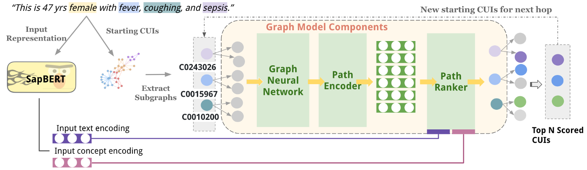

# DR.KNOWs: Diagnostic Reasoning Knowledge Graphs for LLM Diagnosis Prediction 



This is the code repository for our DR.Knows Paper. Please cite us if you are using this repo: 

Gao Y, Li R, Caskey J, Dligach D, Miller T, Churpek MM, Afshar M. Leveraging a medical knowledge graph into large language models for diagnosis prediction. arXiv preprint arXiv:2308.14321. 2023 Aug 28. 

OR 

Gao Y, Li R, Croxford E, Tesch S, To D, Caskey J, W. Patterson B, M. Churpek M, Miller T, Dligach D, Afshar M. Large language models and medical knowledge grounding for diagnosis prediction. medRxiv. 2023 Nov 27:2023-11.

The paper is currently under reviewed. 


## Requirements 
Before training, ensure that the following packages are installed:

- Python 3.x
- PyTorch
- Transformers (from HuggingFace)
- NumPy
- Pandas
- tqdm
- mpi4py (for parallelization)
- NetworkX
- Faiss (for distance calculations)
- Pickle
 

## Step 0: Setup QuickUMLS 

## Step 1: Prepare Data: Download pre-build KG and CUI embedding

Ensure your data files are prepared in the correct format before starting training. You will need:

- Training data: JSON format, containing input text, CUI (Concept Unique Identifiers), and paths.
- Development data: JSON format, structured similarly to the training data.
- Graph files: Preprocessed SNOMED-CT graph and edge mappings.
- CUI vocab and embeddings: Pretrained CUI embeddings (e.g., from SapBERT). 

Pre-build UMLS SNOMED CUI graph object (with physician selected relations pertinent to diagnosis): [download](https://drive.google.com/file/d/1zlb0zey_tAnFWtCY_NvhA0dqfydL4Ph7/view?usp=sharing) This file is about 700 MB. 

Pre-build Graph CUI Embedding (generated from SapBERT encoder): [download](https://drive.google.com/file/d/1a2axTk35wsvQ4AJOheZnjZJdyksHg1cy/view?usp=sharing) For each CUI, we generated embedding using `CUI Preferred Text 1 [SEP] CUI Preferred Text 2 [SEP] ... [SEP]`. This gives us the best semantic representation in our preliminary experiments. This file is about 1.3 GB. 

Besides the above files, we also provide the `CUI-Preferred Text` vocabulary ([Download here](https://drive.google.com/file/d/1xnZyz_ePAcXzmzCaqJHsAI0sf8LsG8DA/view?usp=sharing)). 

You could also choose to generate your own CUI embedding file, using the `generate_CUI_embedding.py` script. 
 

## Step 2: Training

We offer two trainer for DR.Knows: Multi-head Attention and Trilinear Attention. Both trainer scripts are optimized for MPI (training reduced to 2-3 hours on 5k notes input), so please have [mpi4py](https://mpi4py.readthedocs.io/en/stable/) installed. 

The training parameters can be set directly in the command line or through the argument parser in the script. Key parameters include:

```
--lr: Learning rate for the model (default: 1e-5).
--max_k: Number of hops in the graph (default: 2).
--top_n: Number of top paths per iteration (default: 8).
--epoch: Number of training epochs (default: 10).
--gnn_update: Whether to update GNN layers during training (default: True).
--train_data: Path to the training data.
--dev_data: Path to the development data.
--cui_weight_path: Path to the CUI weights file.
--output_path: Path to save model checkpoints and outputs.
```

To start training, use the following command:
 ``python triattn_trainer.py --lr 1e-5 --max_k 2 --top_n 8 --epoch 10 --train_data ./data/mimic_k2_train.json --dev_data ./data/mimic_k2_dev.json --output_path ./output/`` 


## Step 3: Inference 

### Format Your Test Set 
The input data for clinical notes or patient records needs to be provided in a structured format that the model can process. The data will be loaded from a file (JSON or pickle format) and fed into the model for prediction.

Data Fields:

- Input text: The clinical notes or patient records that describe the patient’s condition, symptoms, diagnoses, etc.
- Input CUIs (Concept Unique Identifiers): A list of CUIs that represent the medical concepts extracted from the input text.
- Paths (Optional): If available, the known paths or relationships between CUIs in the data. This can be used in training or evaluation settings.

Input File Format Options:

- JSON Format
- Each data point (clinical note) is stored as a key-value pair.
- Example:
```
  {
  "data_1": {
    "input text": "Patient has a history of hypertension and presents with chest pain.",
    "input A CUI": ["C0011847", "C0013404"],  # Hypertension and Chest Pain CUIs
    "paths": [
      ["C0011847", "C0013404"],  # Example path (CUI relationships)
      ["C0011847", "C0027051"]   # Another potential path
    ]
  },
  "data_2": {
    "input text": "Diabetes patient with kidney failure.",
    "input A CUI": ["C0011849", "C0022658"],  # Diabetes and Kidney Failure CUIs
    "paths": [
      ["C0011849", "C0022658"]
    ]
  }
}
```
 
### Load Pretrained Models

In this step, you will need the saved checkpoints from training, they are: 
- `gmodel.pth`: the saved state of the graph model (referred to as gmodel in the code), which is a key component of the system used for reasoning over clinical data.
- `encoder.pth` is the saved state of a pretrained language model 

Load the pretrained models as shown in the script: 
```
tokenizer = AutoTokenizer.from_pretrained("/home/ygao/LAB_SHARED/home/ygao/nlp_models/SapBERT-from-PubMedBERT-fulltext")
model = AutoModel.from_pretrained("/home/ygao/LAB_SHARED/home/ygao/nlp_models/SapBERT-from-PubMedBERT-fulltext")

pretrained_model_path = "/home/ygao/LAB_SHARED/PROJECTS/049-Clinical_Diagnostic_Reasoning/Sandbox/ygao_KG/Models/Wisc_Models/k2_N12_H3_CL_V4_CosinewBERT_TRATTN_Weight_Stack_Flat_Oracle01-06-23-21/"
trainer.gmodel.load_state_dict(torch.load(pretrained_model_path + "gmodel.pth"))
trainer.encoder.load_state_dict(torch.load(pretrained_model_path + "encoder.pth"))
```

### How do `gmodel.pth` and `encoder.pth` work together during inference?

- Step 1: Embedding Text: The encoder.pth takes clinical notes or patient records and converts them into vector representations using a transformer model like SapBERT.
- Step 2: Graph Traversal: The embeddings from encoder.pth are then fed into the graph model (gmodel.pth), which traverses the clinical concept graph (using Graph Neural Network layers) to reason about the relationships between clinical concepts.
- Step 3: Path Ranking: The graph model encodes paths in the graph (sequences of concepts and relationships) and ranks them to determine which concepts are most likely relevant to the input text.
- Step 4: Final Prediction: Based on the ranked paths, the model makes a final prediction about which clinical concept(s) are relevant to the input text.


### Output Format

The output will be a JSON file containing the predicted clinical concept paths for each input note. An example output file format is as follows: 

```
{
    "note1": ["C0006826 --> causes --> C0002871"],
    "note2": ["C0018801 --> results_in --> C0002871"]
}
```

The target (destination) CUIs are the predicted CUIs. You will need to use the `CUI-Preferred Text` to convert back the preferred text before injecting them into LLMs. 
